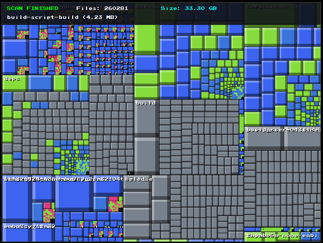

[](https://deepwiki.com/plops/pge_treemap)

# PGE Treemap

A fast, interactive disk space visualizer built in modern C++23 and powered by **[olcPixelGameEngine3 (PGE3)](https://github.com/OneLoneCoder/olcPixelGameEngine3)**.

`pge_treemap` recursively scans your filesystem in a background worker thread and builds a live hierarchical Cushion Treemap (similar to *WinDirStat*, *KDirStat*, and *SequoiaView*) to help you spot disk space hogs instantly.


---

## Features

- **Live Asynchronous Scanning:** The filesystem scan runs in a separate thread and continuously updates the visual layout without blocking the UI or render loop.
- **Cushion Treemap Rendering:** Implements adaptive cushion shading (pseudo-3D lighting and beveling) to make nested directories visually distinct.
- **Color-Coded File Types:** Intuitive WinDirStat-style palette based on file extensions:
  - 🟣 **Media / Video:** `.mp4`, `.mkv`, `.avi`, `.mov`
  - 🟡 **Audio:** `.mp3`, `.flac`, `.wav`, `.ogg`
  - 🔵 **Images:** `.png`, `.jpg`, `.jpeg`, `.webp`, `.gif`
  - 🔴 **Archives:** `.zip`, `.tar`, `.gz`, `.7z`, `.rar`
  - 🟢 **Code & Documents:** `.cpp`, `.rs`, `.py`, `.js`, `.txt`, `.md`
  - 🔷 **Executables / Binaries:** `.bin`, `.so`, `.exe`
  - 🎨 **Dynamic fallback:** Deterministic HSL color hashing for all other extensions.
- **Interactive Camera:** Smooth pan and mouse-centric zoom into dense directory structures.
- **Real-time HUD:** Displays scan progress, total files indexed, total storage calculated, and hovered node metadata.

---

## Controls

| Action | Control |
|---|---|
| **Pan / Move Canvas** | `Left Click` or `Middle Click` + Drag |
| **Zoom in / out** | `Mouse Wheel` (centered around mouse pointer) |
| **Reset View** | `Spacebar` |
| **Inspect Node** | Hover mouse over any block |

---

## Download Pre-built Binaries

Pre-compiled 64-bit Linux binaries are built automatically via GitHub Actions.

Download the latest executable from the **[Releases](https://github.com/plops/pge_treemap/releases)** page:

```bash
# Download latest release
wget https://github.com/plops/pge_treemap/releases/latest/download/pge_treemap

# Make executable and run
chmod +x pge_treemap
./pge_treemap


## Source Code Structure


The codebase has been refactored into self-contained files prefixed with numerical increments (`000_`, `010_`, `020_`, ...), allowing future components (such as file filters, search indexes, exporters, or custom renderers) to be dropped in between (e.g. `015_...`, `045_...`) without renaming existing files.

---

### File Overview
* `src/000_platform_fix.hpp` — Linux/X11 idle CPU spin interceptor.
* `src/010_types.hpp` — Core data structures (`FileNode`, `SharedScanContext`, `LayoutRect`, `SquarifyItem`).
* `src/020_color_utils.hpp` — Color hashing, HSL conversions, and byte formatting.
* `src/030_thread_pool.hpp` — General-purpose task thread pool.
* `src/040_file_watcher.hpp` — Dedicated Linux `inotify` watcher with debounced event processing and fallback stub.
* `src/050_treemap_layout.hpp` — Squarified treemap layout engine with parallel subtree recursion.
* `src/060_scanner.hpp` — Recursive directory scanner, tree cloner, and snapshot publisher.
* `src/070_treemap_app.hpp` — PixelGameEngine application, cushion rendering, camera panning/zooming, and HUD.
* `src/080_cli.hpp` — Command-line argument parsing and directory validation.
* `src/090_main.cpp` — Engine entry point defining `OLC_PGE3_APPLICATION`.
